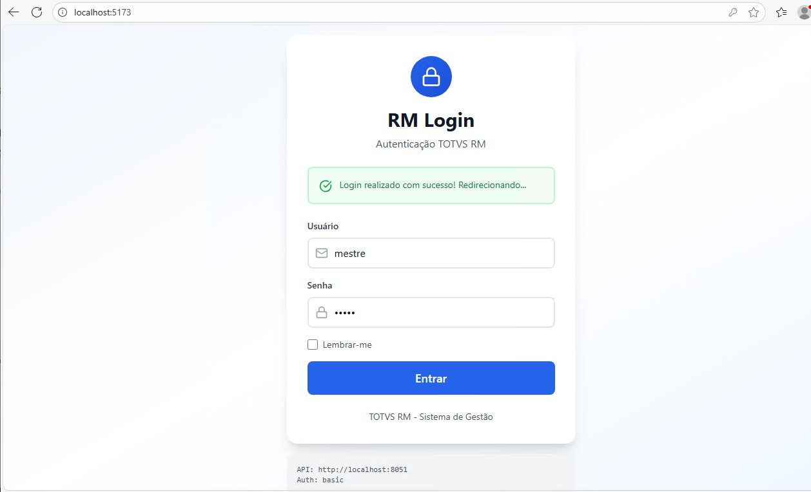
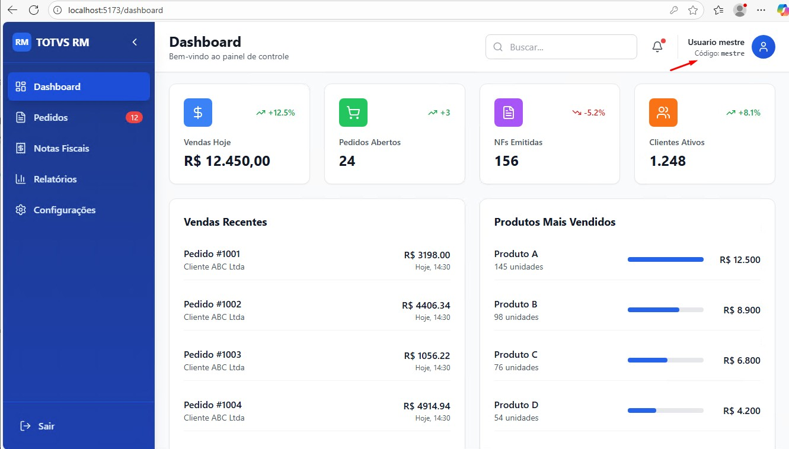

# 🔐 RM Login

Sistema de autenticação e dashboard para **TOTVS RM** desenvolvido com React, Vite e Tailwind CSS.


Sistema moderno de autenticação integrado com a API do TOTVS RM. Desenvolvido com React, Tailwind CSS e shadcn/ui.

---

## 📋 Índice

- [Sobre o Projeto](#sobre-o-projeto)
- [Funcionalidades](#funcionalidades)
- [Tecnologias](#tecnologias)
- [Pré-requisitos](#pré-requisitos)
- [Instalação](#instalação)
- [Configuração](#configuração)
- [Uso](#uso)
- [Estrutura de APIs](#estrutura-de-apis)
- [Estrutura do Projeto](#estrutura-do-projeto)
- [Capturas de Tela](#capturas-de-tela)
- [Roadmap](#roadmap)
- [Contribuindo](#contribuindo)
- [Licença](#licença)
- [Contato](#contato)

---

## 🎯 Sobre o Projeto

O **RM Login** é uma aplicação web moderna que fornece autenticação segura e um dashboard interativo para o sistema **TOTVS RM**. Desenvolvido com as mais recentes tecnologias front-end, oferece uma experiência de usuário fluida e responsiva.

### Por que este projeto?

- ✅ Interface moderna e intuitiva
- ✅ Autenticação segura com TOTVS RM API
- ✅ Dashboard com visualização de dados em tempo real
- ✅ Totalmente responsivo (mobile, tablet, desktop)
- ✅ Código limpo e bem documentado
- ✅ Pronto para produção

---

## ✨ Funcionalidades

### Implementadas

- ✅ **Autenticação**
  - Login com credenciais TOTVS RM
  - Validação de formulário em tempo real
  - Mensagens de erro persistentes
  - Opção "Lembrar-me"
  - Redirecionamento automático após login

- ✅ **Dashboard**
  - Sidebar navegável e retrátil
  - Header com informações do usuário
  - Cards de estatísticas (Vendas, Pedidos, NFs, Clientes)
  - Tabela de vendas recentes
  - Gráfico de produtos mais vendidos
  - Design responsivo

- ✅ **Navegação**
  - Rotas protegidas por autenticação
  - Redirecionamento automático
  - Navegação entre páginas

### Em Desenvolvimento

- 🚧 Módulo de Pedidos
- 🚧 Módulo de Notas Fiscais
- 🚧 Módulo de Relatórios
- 🚧 Configurações de usuário
- 🚧 Gráficos interativos
- 🚧 Exportação de dados
- 🚧 Notificações em tempo real

---

## 🚀 Tecnologias

Este projeto foi desenvolvido com as seguintes tecnologias:

### Core

- [React](https://reactjs.org/) - Biblioteca JavaScript para interfaces
- [Vite](https://vitejs.dev/) - Build tool e dev server
- [React Router](https://reactrouter.com/) - Roteamento

### Estilização

- [Tailwind CSS](https://tailwindcss.com/) - Framework CSS utility-first
- [Lucide React](https://lucide.dev/) - Ícones modernos

### HTTP & API

- [Axios](https://axios-http.com/) - Cliente HTTP

### Qualidade de Código

- [ESLint](https://eslint.org/) - Linter JavaScript
- [Prettier](https://prettier.io/) - Formatador de código
- [Vitest](https://vitest.dev/) - Framework de testes

---

## 📦 Pré-requisitos

Antes de começar, você precisa ter instalado:

- [Node.js](https://nodejs.org/) (versão 16 ou superior)
- [npm](https://www.npmjs.com/) ou [yarn](https://yarnpkg.com/)
- [Git](https://git-scm.com/)

### Verificar instalação:

```bash
node --version  # v16.x ou superior
npm --version   # 8.x ou superior
git --version   # 2.x ou superior
```

---

## 🔧 Instalação

### 1. Clone o repositório

```bash
git clone https://github.com/DiegoBuenoS/loginRM.git
cd loginRM
```

### 2. Instale as dependências

```bash
npm install
```

### 3. Configure as variáveis de ambiente

```bash
cp .env.example .env.local
```

Edite o arquivo `.env.local` com suas configurações:

```env
# URL da API TOTVS RM
VITE_API_BASE_URL=http://seu-servidor:8051

# Contexto (código da empresa/coligada)
VITE_CONTEXT=1

# Ambiente
MODE=development
```

### 4. Inicie o servidor de desenvolvimento

```bash
npm run dev
```

Acesse: http://localhost:5173

---

## ⚙️ Configuração

### Variáveis de Ambiente

| Variável | Descrição | Padrão | Obrigatório |
|----------|-----------|--------|-------------|
| `VITE_API_BASE_URL` | URL base da API TOTVS RM | `http://localhost:8051` | ✅ |
| `VITE_CONTEXT` | Contexto/Coligada | `1` | ✅ |
| `MODE` | Ambiente de execução | `development` | ❌ |

### Endpoints da API

O sistema utiliza os seguintes endpoints do TOTVS RM:

- `GET /api/framework/v1/users/{username}` - Autenticação e dados do usuário
- `GET /api/framework/v1/consultaSQLServer/RealizaConsulta/{codSentenca}/{codColigada}/{codSistema}/?PARAMETERS=...` - Execução de sentenças SQL cadastradas

Para mais informações, consulte a [documentação oficial do TOTVS RM](https://tdn.totvs.com/pages/releaseview.action?pageId=419548959).

---

## 🔌 Estrutura de APIs

### Config centralizada

Todas as configurações das chamadas ficam em:

- `src/config/api.config.js` → seção `CONSULTA_SQL` + `BASE_URL` + `AUTH`

Pontos principais:

- `CONSULTA_SQL.BASE_PATH` → caminho da consulta SQL
- `CONSULTA_SQL.COD_COLIGADA_PATH` → coligada na URL
- `CONSULTA_SQL.COD_SISTEMA` → sistema
- `CONSULTA_SQL.COD_COLIGADA_PARAM` → coligada enviada nos parâmetros
- `CONSULTA_SQL.SENTENCAS` → códigos das sentenças (ex.: `INT.001`, `INT.002`)
- `CONSULTA_SQL.PARAMS` → nomes dos parâmetros (`usuario`, `codcoligada`)

### Serviços (boa prática)

Camadas separadas por responsabilidade:

- `src/services/apiClient.js` → client HTTP + interceptors
- `src/services/auth.service.js` → login, logout, getUserInfo
- `src/services/consultaSql.service.js` → build/get da ConsultaSQL
- `src/services/index.js` → exports centralizados

### Exemplo de ConsultaSQL

Formato que o RM espera:

```
.../RealizaConsulta/INT.001/0/G/?PARAMETERS=usuario=mestre;codcoligada=1
```

No front, o helper monta a URL com base no `API_CONFIG.CONSULTA_SQL`.

### Observações importantes

- O parâmetro `PARAMETERS` é sensível ao formato (maiusculo) e ao encoding.
- Para ambiente local com CORS bloqueado, use o proxy do Vite:
  - `vite.config.js` → `server.proxy['/api']`
- Em produção, é necessário liberar CORS na API ou usar um proxy backend.

---

## 💻 Uso

### Desenvolvimento

```bash
# Iniciar servidor de desenvolvimento
npm run dev

# Executar testes
npm run test

# Executar testes com interface
npm run test:ui

# Verificar cobertura de testes
npm run test:coverage

# Verificar código (lint)
npm run lint

# Corrigir problemas de lint
npm run lint:fix

# Formatar código
npm run format
```

### Build para Produção

```bash
# Criar build otimizado
npm run build

# Visualizar build localmente
npm run preview
```

---

## 📁 Estrutura do Projeto

```
loginRM/
├── public/              # Arquivos estáticos
├── src/
│   ├── components/      # Componentes React
│   │   ├── ui/         # Componentes UI reutilizáveis
│   │   │   ├── Button.jsx
│   │   │   └── Input.jsx
│   │   ├── Header.jsx  # Cabeçalho do dashboard
│   │   └── Sidebar.jsx # Menu lateral
│   ├── pages/          # Páginas da aplicação
│   │   ├── LoginPage.jsx
│   │   └── DashboardPage.jsx
│   ├── services/       # Serviços e APIs
│   │   └── api.service.js
│   ├── config/         # Configurações
│   │   └── api.config.js
│   ├── utils/          # Utilitários
│   │   └── cn.js
│   ├── App.jsx         # Componente raiz
│   ├── main.jsx        # Ponto de entrada
│   └── index.css       # Estilos globais
├── .env.example        # Exemplo de variáveis de ambiente
├── .gitignore          # Arquivos ignorados pelo Git
├── package.json        # Dependências e scripts
├── vite.config.js      # Configuração do Vite
├── tailwind.config.js  # Configuração do Tailwind
└── README.md           # Este arquivo
```

---

## 📸 Capturas de Tela

### Tela de Login



*Tela de autenticação com validação em tempo real*

### Dashboard



*Dashboard com estatísticas e gráficos*

---

## 🗺️ Roadmap

### Versão 1.0 (Atual)

- [x] Sistema de autenticação
- [x] Dashboard básico
- [x] Sidebar navegável
- [x] Design responsivo

### Versão 1.1 (Próxima)

- [ ] Módulo de Pedidos completo
- [ ] Módulo de Notas Fiscais
- [ ] Filtros e busca avançada
- [ ] Exportação de dados (Excel/PDF)

### Versão 2.0 (Futuro)

- [ ] Gráficos interativos (Chart.js)
- [ ] Notificações em tempo real
- [ ] Modo escuro
- [ ] Suporte a múltiplos idiomas
- [ ] Autenticação de dois fatores

---

## 🤝 Contribuindo

Contribuições são bem-vindas! Siga estes passos:

1. Faça um Fork do projeto
2. Crie uma branch para sua feature (`git checkout -b feature/MinhaFeature`)
3. Commit suas mudanças (`git commit -m 'Adiciona MinhaFeature'`)
4. Push para a branch (`git push origin feature/MinhaFeature`)
5. Abra um Pull Request

### Diretrizes

- Siga o padrão de código existente
- Escreva testes para novas funcionalidades
- Atualize a documentação quando necessário
- Use commits semânticos (feat, fix, docs, etc.)

---

## 📄 Licença

Este projeto está sob a licença MIT. Veja o arquivo [LICENSE](LICENSE) para mais detalhes.

---

## 📞 Contato

**Diego Bueno**

- GitHub: [@DiegoBuenoS](https://github.com/DiegoBuenoS)
- LinkedIn: [Diego Bueno](https://www.linkedin.com/in/diego-bueno-cruzeiro-sp/)
- Email: diegobuenocrz@gmail.com

**Link do Projeto:** https://github.com/DiegoBuenoS/loginRM

---

## 🙏 Agradecimentos

- [TOTVS](https://www.totvs.com/) - Pela API do TOTVS RM
- [React](https://reactjs.org/) - Framework incrível
- [Tailwind CSS](https://tailwindcss.com/) - Estilização moderna
- [Lucide](https://lucide.dev/) - Ícones bonitos

---

**Desenvolvido com ❤️ por Diego Bueno**
